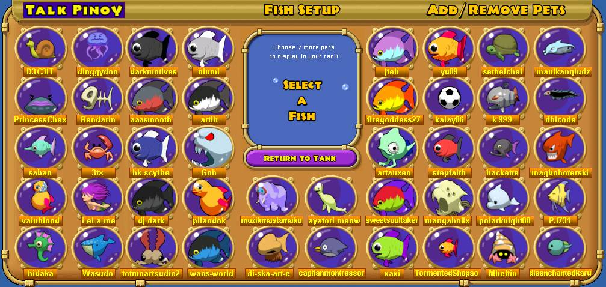
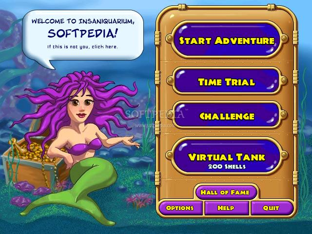
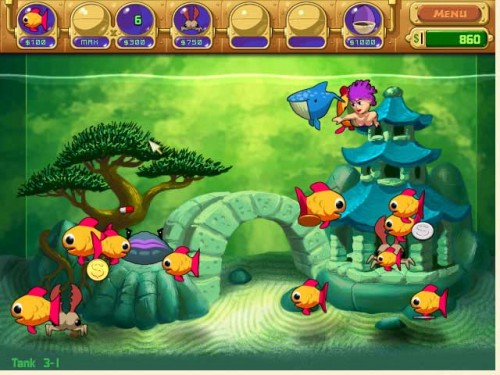
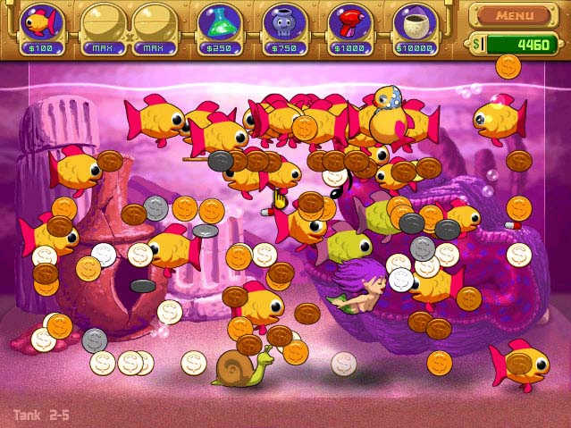

<html>
	<body>
		<h1>Game Insaniquarium</h1>
		
		
<h5>Author: Amelia Apriliani</h5>

		
		

		
Tanggal rilis awal: 2 Mei 2002

		
Perancang: George Fan

		
Penerbit: PopCap Games

		
Pengembang: PopCap Games, Flying Bear Entertainment

		
Platform: Microsoft Windows, Java, Pocket PC, Windows Mobile, Palm OS

				
		<h2>Review as a Designer according to DPE Framework</h2>
		

			<h4>Storytelling Layer</h4>
			
				

				
				Tujuan dari permainan ini adalah memberitahu kita bagaimana memelihara ikan-ikan, dan menghancurkan pengganggu yang bisa membuat peliharaan kita mati.
				Latar tempat yang diberikan menarik karena benar-benar terlihat seperti di aquarium.
				Karakter-karakter yang dibuat juga menyerupai wujud aslinya, seperti: siput, ubur-ubur, kerang, ikan pedang, kura-kura, kepiting, sampai putri duyung yang bisa bernyanyi.
				Selain hewan-hewan tersebut, terdapat hewan pengganggu yang berwujud alien.
				Walaupun ada beberapa hewan yang tidak familiar tetapi tidak mengurangi nilai dari keunikan karakter-karakter tersebut.
				
			<h4>Game Play Layer</h4>
			
				

				
				Di dalam permainan ini terdapat 4 mode permainan yang disediakan, yaitu Adventure Mode, Time Trial Mode, Challenge Mode, dan Virtual Tank.
				
				<h5>Adventure Mode</h5>
				Pada mode ini kita harus memberikan makanan kepada ikan-ikan yang kita pelihara dan ikan tersebut akan menghasilkan koin-koin yang harus kita ambil.
				Pada mode ini kita juga harus membasmi alien agar tidak memakan ikan-ikan kita.
				Jika koin kita sudah cukup, maka kita akan membeli sebuah telur, dan telur tersebut akan mengeluarkan karakter-karakter baru yang bisa kita pakai. 
				Di mode ini terdapat 4 level yang harus diselesaikan.
				
				<h5>Time Trial Mode</h5>
				Pada mode ini kita akan diberikan waktu tertentu untuk bermain. Misalnya mengumpulkan koin sebanyak-banyaknya dalam waktu 5 menit. Koin yang terkumpul akan diubah menjadi shell senilai 5% koin yang kita dapat.
				Setelah memenangkan satu level Time Trial Mode, kita akan mendapatkan kerang untuk Virtual Tank Mode. Ini adalah salah satu cara untuk mengumpulkan kerang.
			
				<h5>Challenge Mode</h5>
				Mode ini merupakan mode yang paling susah untuk dimainkan. Ada 4 level yang sesuai dengan level di Adventure Mode.
				Harga barang di Challenge Mode semakin naik setiap beberapa detik, maka secepat mungkin kita harus membeli apa yang kita butuhkan.
				Setiap memenangkan Challenge, kita akan diberikan sebuah cerita tentang pet.
				
				<h5>Virtual Tank Mode</h5>
				Pada mode yang terakhir ini kita akan memelihara ikan seperti di dunia nyata.
				Koin yang digunakan untuk memberikan makanannya adalah menggunakan shells.
				
			<h4>User Experience Layer</h4>
				
				

				
				Permainan ini cukup menyenangkan untuk dimainkan, terlebih karena penggambaran karakter dan juga didukung dengan musik yang sesuai.
				Di tiap level yang berbeda disajikan latar aquarium dengan tema yang berbeda, itu membuat permainan ini tidak membosankan.
				Karena kita pasti akan menanti-nantikan latar tempat yang seperti apa lagi yang akan disajikan.
				Dalam mengumpulkan karakter kita juga menantikan karakter apalagi yang akan kita dapatkan. Karakter tersebut mempunyai fungsi yang berbeda-beda.
				
				
		

		
		<h2>Review as a Player</h2>
		
		

		
		

			Pertama kali memainkan permainan ini adalah ketika Sekolah Dasar. Permainan ini merupakan bagian dari Game House yang sudah terdapat di komputer.
			Permainan yang memiliki tampilan dan musik yang menarik, membuat orang penasaran untuk memainkannya.
			Permainan Insaniquarium sangat melatih kecepatan tangan dalam menekan tombol mouse.
			Karena untuk memberi makanan, mengambil koin dan membunuh musuh hanya digunakan dengan menekan tombol mouse.
			Permainan yang seru karena bisa dimainkan oleh berbagai kalangan, mulai dari anak-anak hingga orang dewasa yang sedang dilanda kebosanan.
			Insaniquarium terdiri dari beberapa level, yang memiliki tingkat kesulitan yang bertahap pada setiap levelnya.
			Dan setiap berganti level maka latar aquarium akan berubah tema.
		

		

			Ada beberapa aturan dalam permainan ini diantaranya adalah kita harus mengumpulkan koin sebanyaknya, memberikan makanan pada ikan-ikan yang ada, membunuh alien yang datang dan jangan membiarkan ikan-ikan kita habis karena dimakan alien dan kelaparan.
			Untuk dapat bertahan dalam satu level yang sulit, kita harus mampu mengalahkan alien yang datang dan menyingkirkan mereka selama mungkin.
			Walaupun pada dasarnya seberapa banyak alien yang kita bunuh tidak akan selesai begitu saja, karena mereka akan terus berdatangan selama kita belum dapat mengumpulkan koin untuk dapat ditukar dengan telur ikan.
		

		

			Permainan Insaniquarium memiliki banyak kelebihan dibandingkan permainan produksi “Game House” lain.
			Dalam segi grafis cukup menarik dengan design dan musik yang bagus.
			Tidak hanya mempunyai satu mode, tetapi terdapat beberapa mode seperti Adventure, Time Trial, Challenge dan juga Virtual Tank.
			Bisa melatih anak-anak untuk memelihara hewan seperti ikan.
			
		

	</body>
<html>
