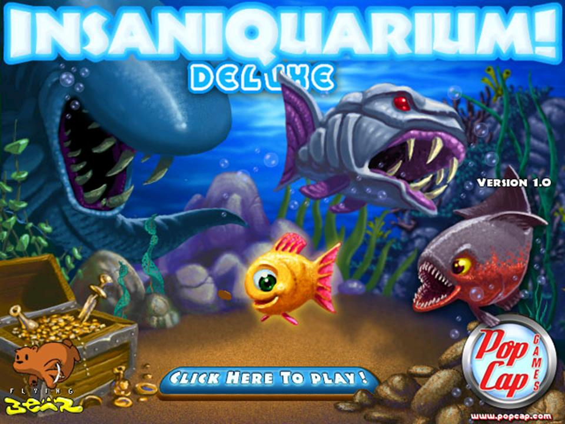

<html>
	<body>
		<h1>Game Insaniquarium</h1>
		
		

		<h2>Latar Belakang</h2>

		
Tanggal rilis awal: 2 Mei 2002

		
Perancang: George Fan

		
Penerbit: PopCap Games

		
Pengembang: PopCap Games, Flying Bear Entertainment

		
Platform: Microsoft Windows, Java, Pocket PC, Windows Mobile, Palm OS

		
		

			Permainan insaniquarium merupakan sebuah permainan yang pemeran utamanya adalah ikan.
			Berlatar tempat di sebuah aquarium yang didalamnya juga terdapat hewan-hewan air lainnya, seperti:
			siput, ubur-ubur, kerang, ikan pedang, kura-kura, kepiting, sampai putri duyung yang bisa bernyanyi.
			Selain hewan-hewan tersebut, terdapat hewan pengganggu yang berwujud alien.
			Di dalam permainan ini terdapat 4 mode permainan yang disediakan, yaitu Adventure Mode, Time Trial Mode, Challenge Mode, dan Virtual Tank.
	
			

			
			<h4>Adventure Mode</h4>
			Pada mode ini kita harus memberikan makanan kepada ikan-ikan yang kita pelihara dan ikan tersebut akan menghasilkan koin-koin yang harus kita ambil.
			Pada mode ini kita juga harus membasmi alien agar tidak memakan ikan-ikan kita.
			Jika koin kita sudah cukup, maka kita akan membeli sebuah telur, dan telur tersebut akan mengeluarkan karakter-karakter baru yang bisa kita pakai. 
			Di mode ini terdapat 4 level yang harus diselesaikan.
			
			<h4>Time Trial Mode</h4>
			Pada mode ini kita akan diberikan waktu tertentu untuk bermain. Misalnya mengumpulkan koin sebanyak-banyaknya dalam waktu 5 menit. Koin yang terkumpul akan diubah menjadi shell senilai 5% koin yang kita dapat.
			Setelah memenangkan satu level Time Trial Mode, kita akan mendapatkan kerang untuk Virtual Tank Mode. Ini adalah salah satu cara untuk mengumpulkan kerang.
		
			<h4>Challenge Mode</h4>
			Mode ini merupakan mode yang paling susah untuk dimainkan. Ada 4 level yang sesuai dengan level di Adventure Mode.
			Harga barang di Challenge Mode semakin naik setiap beberapa detik, maka secepat mungkin kita harus membeli apa yang kita butuhkan.
			Setiap memenangkan Challenge, kita akan diberikan sebuah cerita tentang pet.
			
			<h4>Virtual Tank Mode</h4>
			Pada mode yang terakhir ini kita akan memelihara ikan seperti di dunia nyata.
			Koin yang digunakan untuk memberikan makanannya adalah menggunakan shells.
		

		
		<h2>Review</h2>
		

		

			<h4>Design</h4>
				Latar tempat yang diberikan menarik karena benar-benar terlihat seperti di aquarium. Karakter-karakter yang dibuat juga menyerupai wujud aslinya.
				Walaupun ada beberapa hewan yang tidak familiar tetapi tidak mengurangi nilai dari keunikan karakter-karakter tersebut.
				Men
			<h4>Play</h4>
				
			<h4>Experience</h4>
				
		

	</body>
<html>
